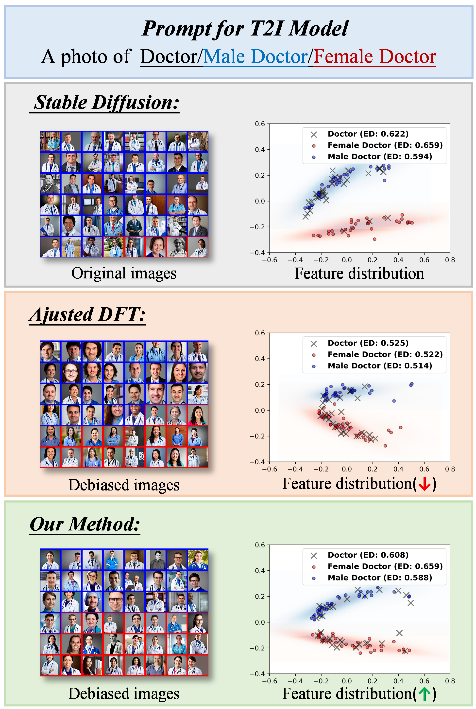

# Fine-tuning Bias Neurons for Fair Text-to-Image Generation

<div align="center">
  
  
</div>
<p align="center"><em>LEFT: Images before and after debiasing and their distribution.</em></p>
<p align="center"><em>RIGHT: Images generated using different methods with the prompt: "a photo of a doctor". The blue box indicates male, the red box indicates female, and the yellow box indicates no face.</em></p>

## Installation Guide

### Environment
1. We manage environments with Conda. To set up the environment, follow these steps:
```
git clone https://github.com/xxx
cd Debias
conda env create -f environment.yml
conda activate debias
```
2. Download the basic SD model, follow these steps:
```
huggingface-cli download --resume-download runwayml/sd-v1-5 --local-dir runwayml/sd-v1-5
```
3. Download classifier_weight from this [data](https://drive.google.com/file/d/18FAu5rxGC2AlC3IN43lukE6Rgyyff3AR/view?usp=share_link) in paper[1] to the working directory, unzip it by:
```
unzip data.zip
```
This will create a data folder in the current working directory.

## Training Guide

After installation, follow these instructions to train SD model.
1. Firstly, bias-sensitive neurons are located in *"index.txt"*, follow these steps:
```
python find_max.py
```
2. Please run the script in `train/` after checking the file path:

```shell
python train/debias_gender/unet_train.py 
```

## Generating Debiasing Images

Please run the script in `infer/`.

For automated batch generation of evaluation images, utilize the following script:

```shell
python gen-images.py \
  --load_debias_unet /unet_gender.pth \
  --prompts_path /outputs/occupation.json \
  --num_imgs_per_prompt 64 \
  --save_dir /outputs/images_debias \
  --gpu_id 0 \
  --batch_size 8
```

## Evaluation

You can execute the following command to evaluate the generated data. Please run the script in `eval/`.

Change the file directory in the code according to the picture location.

```shell
#1. To get "results.pkl"
python test.py
#2. cpmpute bias with "results.pkl"
python compute.py
```

## References

This repo is the code for the paper *Fine-tuning Bias Neurons for Fair Text-to-Image Generation*.

Thanks for the creative ideas of the pioneer researches:

- https://github.com/sail-sg/finetune-fair-diffusion/tree/main: **[1] Finetuning Text-to-Image Diffusion Models for Fairness**

## Citing our work

The preprint can be cited as follows

```bibtex
@misc{xxx
  xxx
}
```
